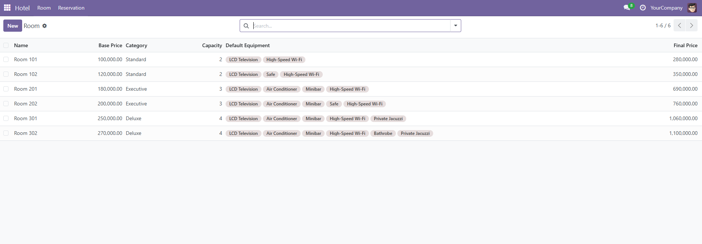
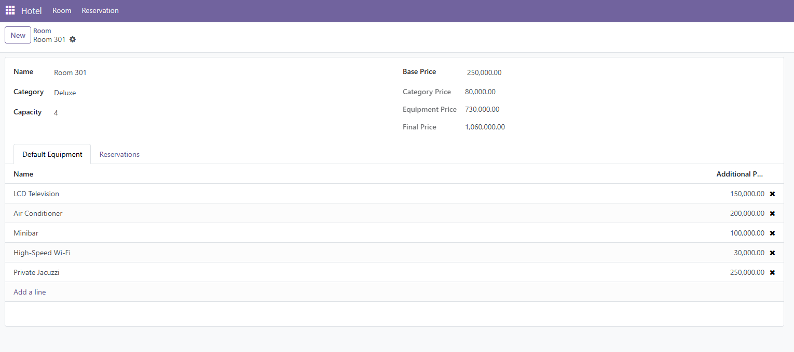
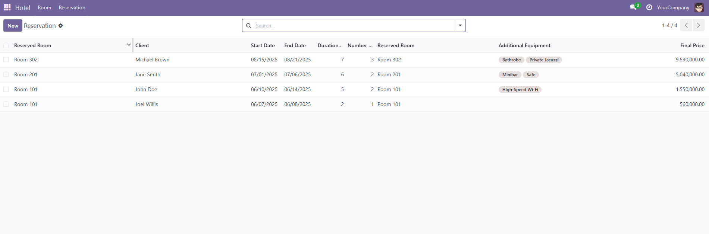
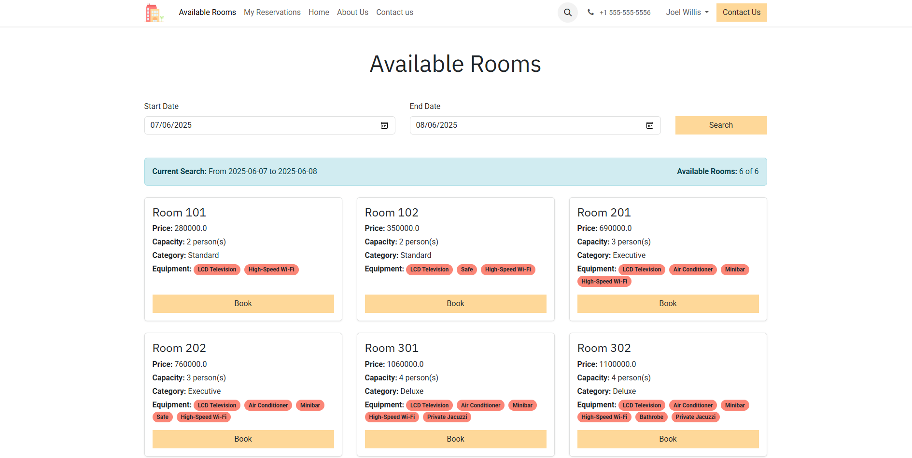
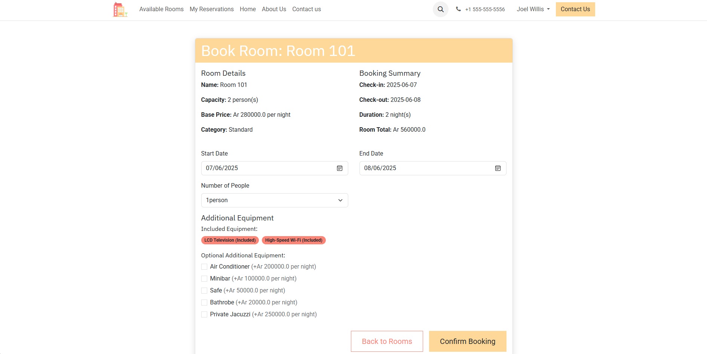
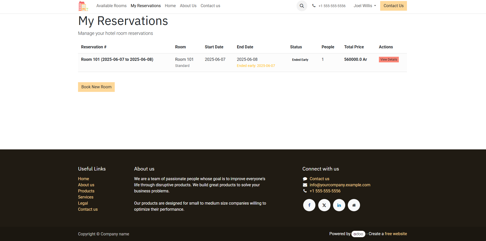

# Hotel Reservation System

A comprehensive hotel room reservation management system built on Odoo 18, featuring both back-office administration and customer portal interfaces, plus a complete REST API for third-party integrations.

## 🏨 Features

### Back-Office Administration
- **Room Management**: Create, edit, and manage hotel rooms with categories and equipment
- **Reservation Management**: View, create, and manage all reservations
- **Equipment Management**: Manage room equipment and pricing
- **Category Management**: Define room categories with additional pricing
- **Pricing Control**: Automatic price calculation based on room, category, and equipment

### Customer Portal
- **Room Availability**: Search and view available rooms by date range
- **Online Booking**: Make reservations with equipment selection
- **Reservation Management**: View and manage personal reservations
- **Early Checkout**: End reservations early when possible

### REST API
- **Room Availability**: Get available rooms for specific date ranges
- **Reservation Management**: Create, view, and end reservations via API
- **Equipment Catalog**: Access equipment information
- **Authentication**: Secure endpoints with user authentication

## 📋 Requirements

- Odoo 18.0+
- Python 3.11+
- PostgreSQL 13+

## 🚀 Installation

1. Clone the repository to your Odoo addons directory:
    ```bash
    git clone https://github.com/LegendaryGhost/odoo-hotel-management /path/to/odoo/addons/hotel
    ```

2. Update your Odoo addons path to include the hotel module

3. Restart Odoo and update the app list

4. Install the "Hotel Reservation System" module from the Apps menu

## 🖥️ Back-Office Interface

### Room List View

*Manage all hotel rooms with filtering and search capabilities*

### Room Form View

*Create and edit room details including categories and default equipment*

### Reservation List View

*Monitor all reservations with status tracking and management tools*

## 🌐 Customer Portal

### Available Rooms

*Search and browse available rooms by date range*

### Booking Form

*Easy-to-use reservation form with room and equipment selection*

### My Reservations

*View and manage personal reservations with early checkout options*

## 🔌 REST API

The system provides a comprehensive REST API for third-party integrations:

### Authentication
Most endpoints require user authentication. Use Odoo's standard authentication mechanism.

### Endpoints

#### Room Management
- `GET /api/v1/rooms/available` - Get available rooms for date range
  - Parameters: `start_date`, `end_date` (YYYY-MM-DD format)

#### Equipment Management
- `GET /api/v1/equipment` - Get all equipment
- `GET /api/v1/equipment/{id}` - Get specific equipment details

#### Reservation Management
- `GET /api/v1/reservations` - Get user's reservations
  - Parameters: `state` (optional), `limit` (optional), `offset` (optional)
- `POST /api/v1/reservations` - Create new reservation
- `POST /api/v1/reservations/{id}/end` - End reservation early

### API Response Format
All API responses follow a standardized format:
```json
{
  "success": true|false,
  "timestamp": "2024-06-07T10:30:00",
  "data": {...},
  "error": "error message if any"
}
```

### Example API Usage

#### Get Available Rooms
```bash
GET /api/v1/rooms/available?start_date=2024-06-15&end_date=2024-06-20
```

#### Create Reservation
```bash
POST /api/v1/reservations
Content-Type: application/json

{
  "start_date": "2024-06-15",
  "end_date": "2024-06-20",
  "people_number": 2,
  "room_id": 1,
  "equipment_ids": [1, 2]
}
```

## 📬 Postman Collection

For easy API testing and integration, we provide a comprehensive Postman collection that includes:

- All API endpoints with example requests
- Environment variables for easy configuration
- Pre-configured authentication
- Sample request bodies and responses
- Test scripts for common scenarios

### Importing the Collection

1. Download the Postman collection file: `rihantiana_97_hotel_module.postman_collection`
2. Open Postman
3. Click "Import" in the top left
4. Select the downloaded collection file

## 🏗️ Database Schema

### Core Models

#### hotel.room
- Room information with pricing and capacity
- Links to categories and default equipment
- Computed final price including all additions

#### hotel.room.reservation
- Reservation details with dates and guest information
- State management (draft, confirmed, in_progress, ended, etc.)
- Price calculations and equipment associations

#### hotel.room.category
- Room categories with additional pricing
- Used for room classification and pricing tiers

#### hotel.room.equipment
- Equipment items with individual pricing
- Can be assigned to rooms as defaults or selected per reservation

## 🔒 Security Features

- **User Authentication**: Secure login for both portal and API access
- **Access Control**: Users can only view/modify their own reservations
- **Data Validation**: Comprehensive validation for dates, capacity, and business rules
- **CORS Support**: Configurable cross-origin resource sharing for API access

## 🎯 Business Rules

- **Date Validation**: End dates must be after start dates
- **Capacity Limits**: Reservations cannot exceed room capacity
- **Availability Checking**: Prevents double-booking of rooms
- **Price Calculation**: Automatic calculation including room, category, and equipment costs
- **State Management**: Proper reservation lifecycle management

## 🛠️ Development

### Model Structure
The system follows Odoo's MVC architecture with:
- **Models**: Business logic and data persistence
- **Views**: XML definitions for forms, lists, and portal pages
- **Controllers**: HTTP request handling for portal and API endpoints

### Customization
The module is designed for easy customization:
- Extend models with additional fields
- Add new reservation states or business rules
- Customize portal templates
- Add new API endpoints

## 📝 Configuration

### Portal Access
Enable portal access in Odoo settings to allow customers to:
- View available rooms
- Make reservations
- Manage their bookings

### API Configuration
Configure API access by:
1. Enabling CORS if needed for web applications
2. Setting up proper user permissions
3. Configuring authentication methods

## 🐛 Troubleshooting

### Common Issues

**Reservation Creation Fails**
- Check date formats (must be YYYY-MM-DD)
- Verify room availability for selected dates
- Ensure user has proper permissions

**API Authentication Issues**
- Verify user credentials
- Check if user has portal access enabled
- Ensure proper Content-Type headers for JSON requests

**Portal Access Problems**
- Verify portal is enabled in Odoo settings
- Check user portal permissions
- Ensure website module is installed

## 📞 Support

For support and questions:
- Check the Odoo documentation
- Review API endpoint documentation
- Use the provided Postman collection for API testing
- Verify database constraints and business rules

## 📄 License

This project is licensed under the LGPL-3 License - see the LICENSE file for details.

## 🤝 Contributing

1. Fork the repository
2. Create a feature branch
3. Make your changes
4. Add tests if applicable
5. Submit a pull request

---

*Built with ❤️ on Odoo 18*
